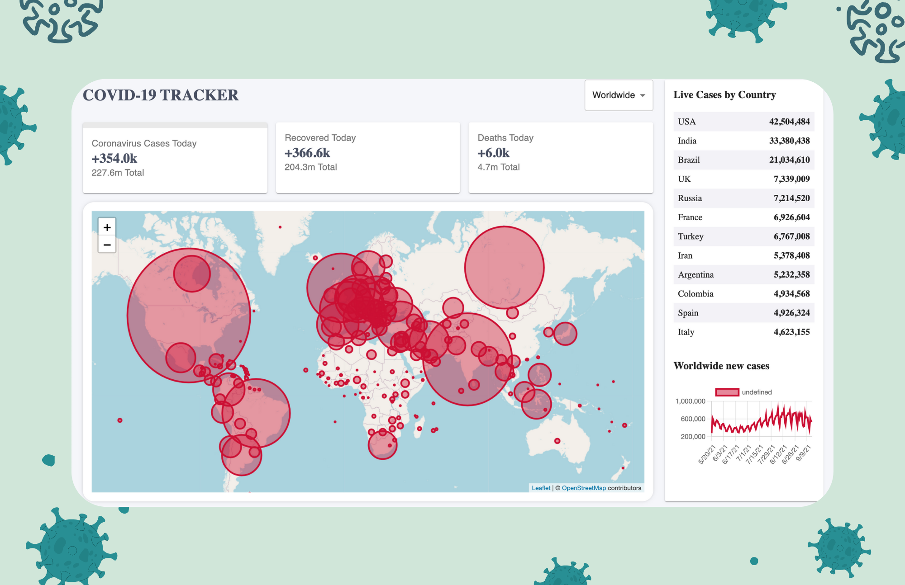

# COVID 19 TRACKER

Covid-19 Tracking dashboard built with React, Material UI, and Leaflet library for the map. Web and mobile responsiveness. The application allows a user to select a specific country from a dropdown to observe current covid 19 trends around the world. The data displayed is pulled from disease.sh API.

Screenshot of application:  

Link to live application: https://nard1n.github.io/covid19tracker/

## Table of Contents

* [Installation](#Installation)
* [Usage](#Usage)
* [Contributing](#Contributing)
* [Tests](#Tests)
* [License](#License)
* [Questions](#Questions)

## Installation
Feel free to clone the repo or reference the code and remember to install all required packages

## Usage
Clean dashboard that's mobile responsive for tracking current covid 19 cases around the world

## Contributing
We love seeing community contributions to opensource projects! Want to make a suggestion? Find a spelling mistake? All messages are greatly appreciated! If you would like to contribute, please do.

## Tests
n/a

## License
This project is released under MIT opensource license:

https://opensource.org/licenses/MIT

## Questions
For more about my work, check out my Github profile: https://github.com/nard1n

If you have any questions and would like to chat, please feel free to send me an email directly to nardin.lachowski@gmail.com